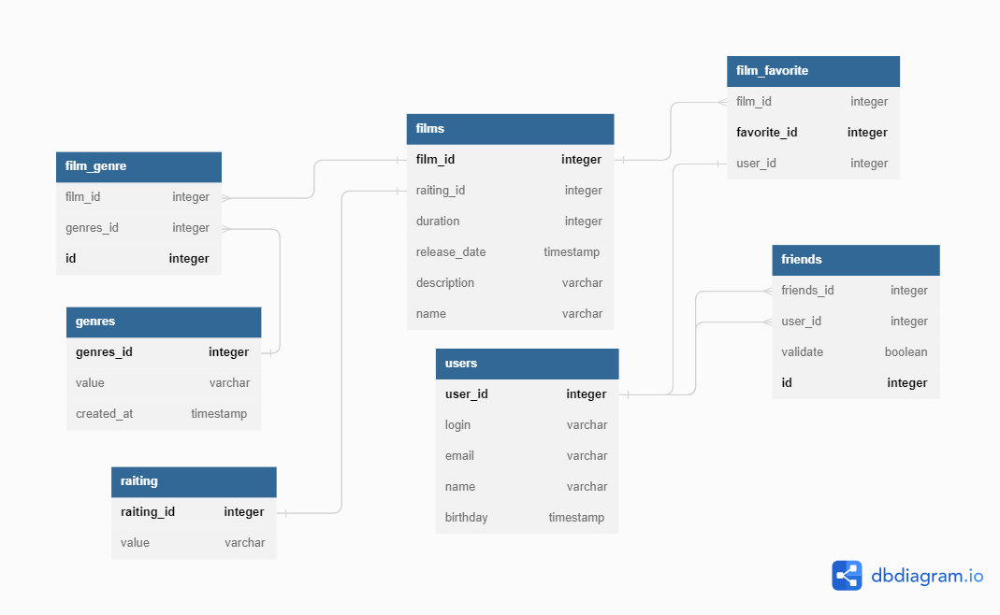

## Это репозиторий проекта "filmorate"  
#### Также здесь лежит схема хранения в реляционной базе данных 

Наше приложение **умеет**:
1. Добавлять пользователей в друзья. 
2. Отмечать понравившееся фильмы. 
3. Добавлять удалять фильмы и пользователей.

#### Таблицы
1. film -  содержит в себе всю информацию по фильмам. Имеет ключи к таблице film_genre (связь один ко многим) и к enum_raiting (связь один к одному)
2. film_genre -  содержит в себе перечень всех жанров фильма по всем фильмам таблицы.  Так же имеет связь с таблицей Genre (многие к одному)
3. Genre - Перечень всевозможных жанров
4. Film_favorite  содержит в себе список id пользователей которые отметили фильм (связи с таблицами  user_storage и film_storage)
5. user -  содержит в себе всю информацию по пользователям имеет связи с таблицами friend_validate friend_non_validate и Film_favorite.
6. friend - список всех потвержденных и непотвержденных друзей соответствено 
Примеры запросов в SQL
Выборка всех популярных фильмов с ограничением:
```java
SELECT name,
COUNT(id_film) as pop
FROM film
GROUP BY name
ORDER BY pop DESC
LIMIT 10
```
Получение общих друзей по id2, id1:
```java
SELECT users.name
From (
SELECT id_friend as id_1
FROM friend AS F1
WHERE id_user = id1
INNER JOIN (
SELECT id_friend as id_1
FROM friend
WHERE id_user = id2) AS F2 ON F1.id_1 = F2.id_2) AS FF
LEFT JOIN user as users on users.id_user = FF.id_1
```

------
